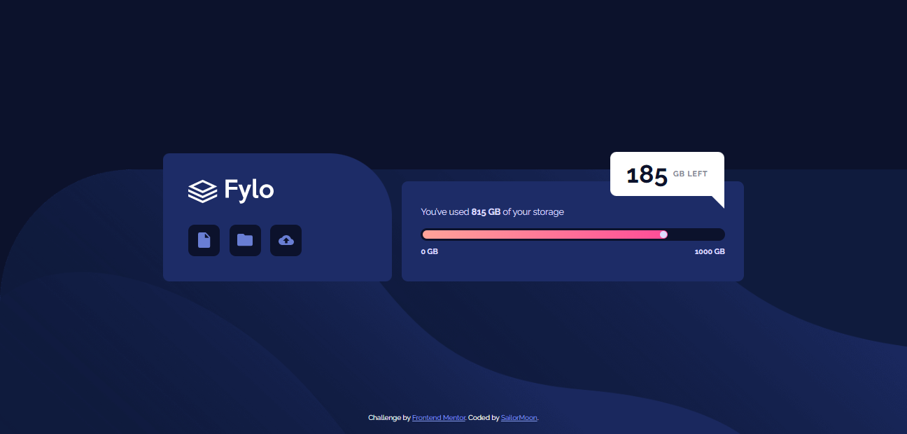

# Frontend Mentor - Fylo data storage component solution

This is a solution to the [Fylo data storage component challenge on Frontend Mentor](https://www.frontendmentor.io/challenges/fylo-data-storage-component-1dZPRbV5n). Frontend Mentor challenges help you improve your coding skills by building realistic projects. 

## Table of contents

- [Overview](#overview)
  - [The challenge](#the-challenge)
  - [Screenshot](#screenshot)
  - [Links](#links)
- [My process](#my-process)
  - [Built with](#built-with)
  - [What I learned](#what-i-learned)
- [Author](#author)
- [Acknowledgments](#acknowledgments)

## Overview

### The challenge

Users should be able to:

- View the optimal layout for the site depending on their device's screen size

### Screenshot

### Links

- Solution URL: [GitHub](https://github.com/SailorMoonDev/frontendMentorChallenges_fylo-data-storage-component_Junior-HTML-CSS)
- Live Site URL: [Site](https://sailormoondev.github.io/frontendMentorChallenges_fylo-data-storage-component_Junior-HTML-CSS/)

## My process

### Built with

- Semantic HTML5 markup
- CSS custom properties
- Flexbox
- Mobile-first workflow

### What I learned

I am just starting out in the world of web development. I'm taking my first steps with HTML and CSS. Knowing learning resources, the FrontMentor challenges have been a great help.

## Author

- Frontend Mentor - [@bonitawendy89](https://www.frontendmentor.io/profile/bonitawendy89)

## Acknowledgments

Thanks to [@mrz.code.manufacture139](https://www.youtube.com/@mrz.code.manufacture139)
